# 8-bit Ripple Carry Adder using 1-bit Full Adders | RTL to GDSII

> This project demonstrates the complete ASIC design flow of an 8-bit Ripple Carry Adder (RCA) using Verilog and Synopsys tools, from RTL to GDSII layout, following industry practices.

---

## 📌 Table of Contents

1. [Objective](#objective)
2. [Tools & Environment](#tools--environment)
3. [Project Architecture](#project-architecture)
4. [Step-by-Step Flow](#step-by-step-flow)
    - RTL Design
    - Simulation
    - Synthesis
    - Floorplanning
    - Power Planning
    - Placement
    - Clock Tree Synthesis
    - Routing
    - Static Timing Analysis
5. [Results](#results)
6. [Conclusion](#conclusion)

---

## Objective

Design, implement, and verify an **8-bit Ripple Carry Adder** using **1-bit Full Adders**, and carry out the complete **ASIC VLSI flow** to generate a GDSII-compatible layout using the **SAED 32nm** standard cell library.

---

## Tools & Environment

| Tool             | Purpose                         |
|------------------|----------------------------------|
| **Verilog HDL**  | RTL Design                      |
| **Synopsys VCS** | Functional Simulation           |
| **Verdi**        | Waveform Debugging              |
| **Design Compiler (DC)** | Logic Synthesis        |
| **ICC2**         | Physical Design (PDK: SAED 32nm)|
| **PrimeTime (PT)**| Static Timing Analysis (STA)   |
| **Linux OS**     | Environment: Rocky Linux        |

---

## Project Architecture

### 1-bit Full Adder (FA)
Computes:
sum = A ⊕ B ⊕ Cin
cout = AB + BCin + ACin

### 8-bit Ripple Carry Adder
Cascaded connection of 8 full adders. Each FA's carry-out is connected to the next FA's carry-in.

---

## Step-by-Step Flow

### 🔹 1. RTL Design

- Files: 
1 bit Full Adder 

  - 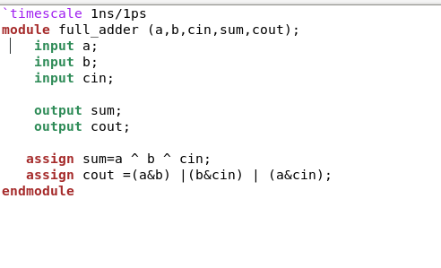
 8 bit Ripple Adder 

  - 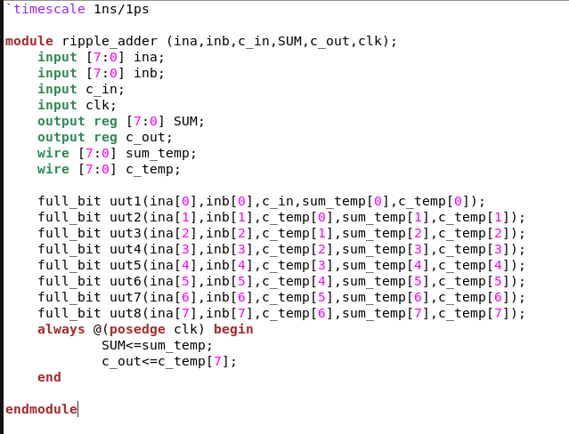
 Testbench of Ripple Adder 

  - 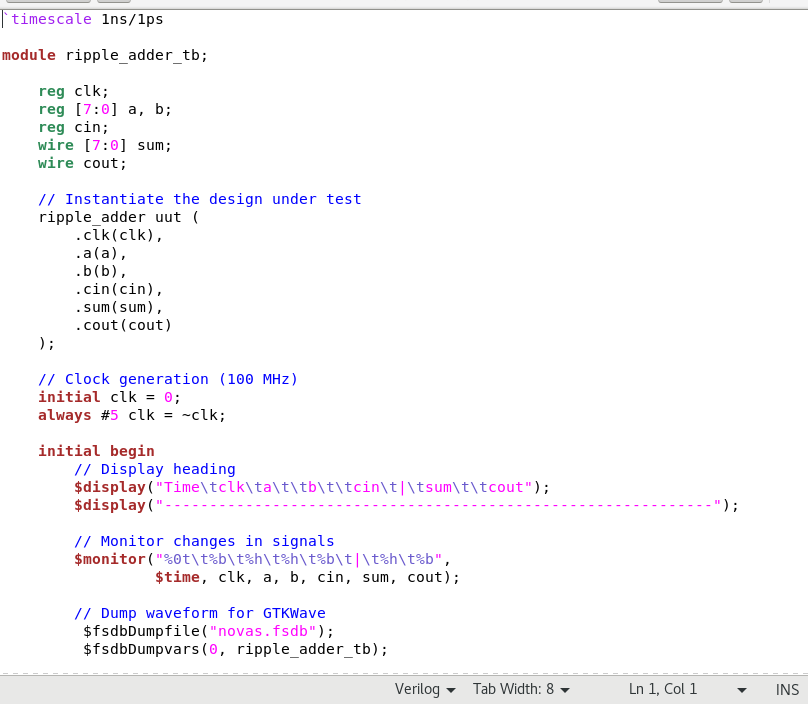 
- Created using Verilog HDL.
- Modular and hierarchical design.

**Gates Used**
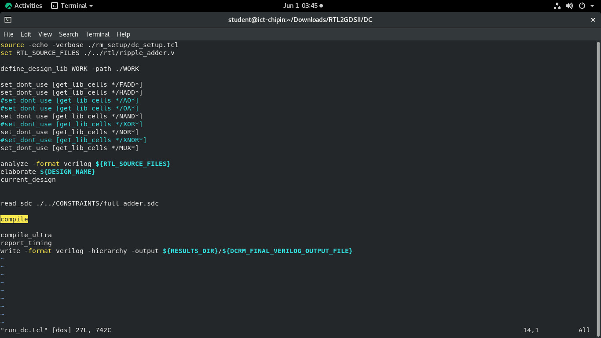

**RTL Schematic:** 
 RTL Schematic 
 
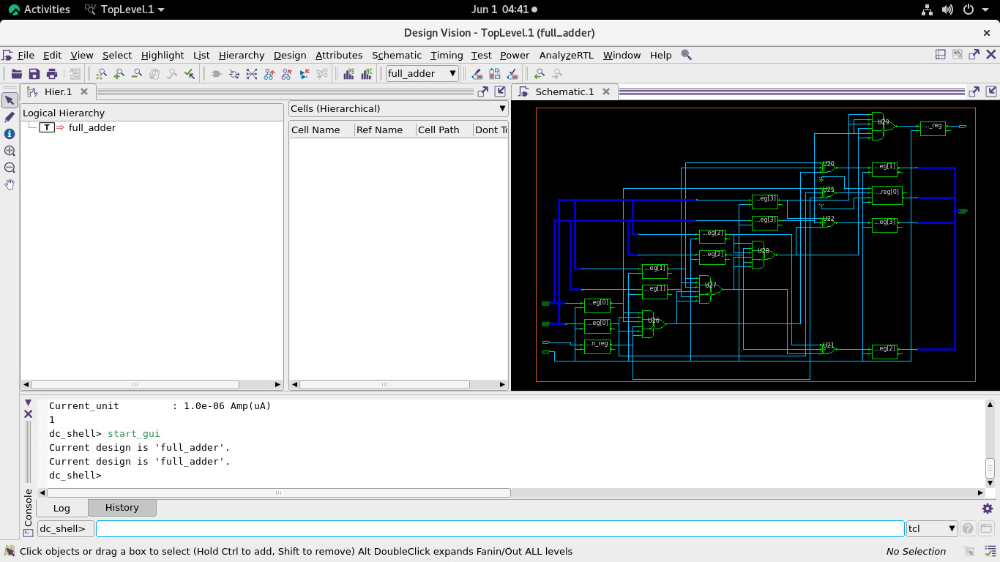

---

### 🔹 2. Simulation

- Tool: Synopsys VCS
- Verilog testbench validates functional correctness.
- Waveform viewed using Verdi (`.fsdb` output)

**Simulation Waveform:**  

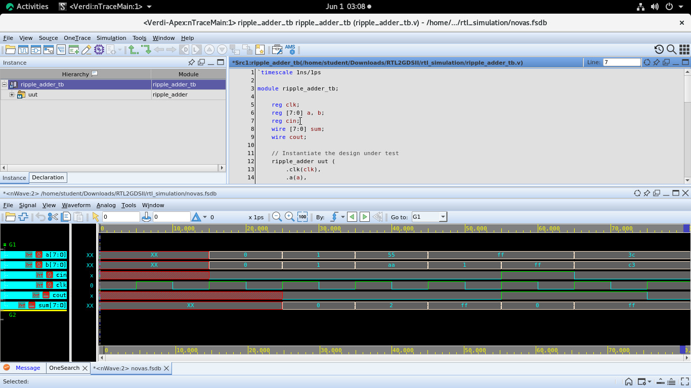

---

### 🔹 3. Synthesis (Design Compiler)

- `compile_ultra` used for optimization.
- Clock constraint: 3.4 ns
- Area and timing reports generated using `report_qor` and `report_timing`

 DC Report:  
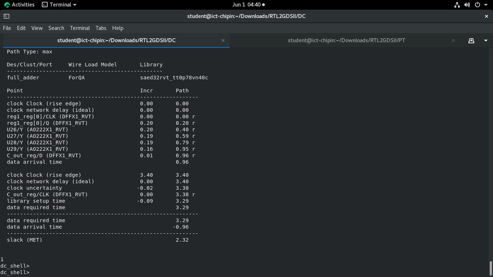
 Constraints File 

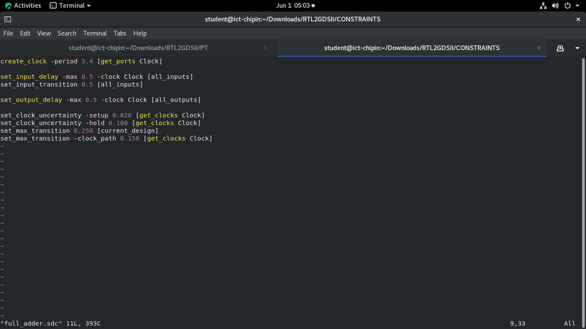

Cell Area 

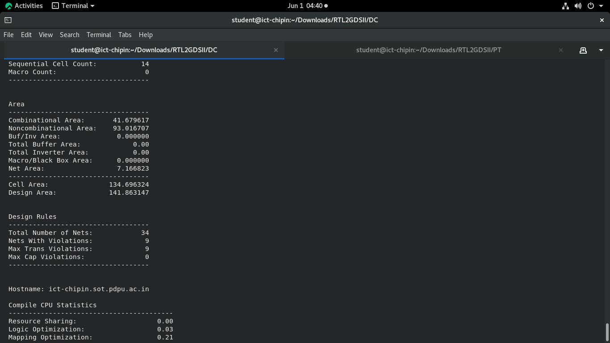

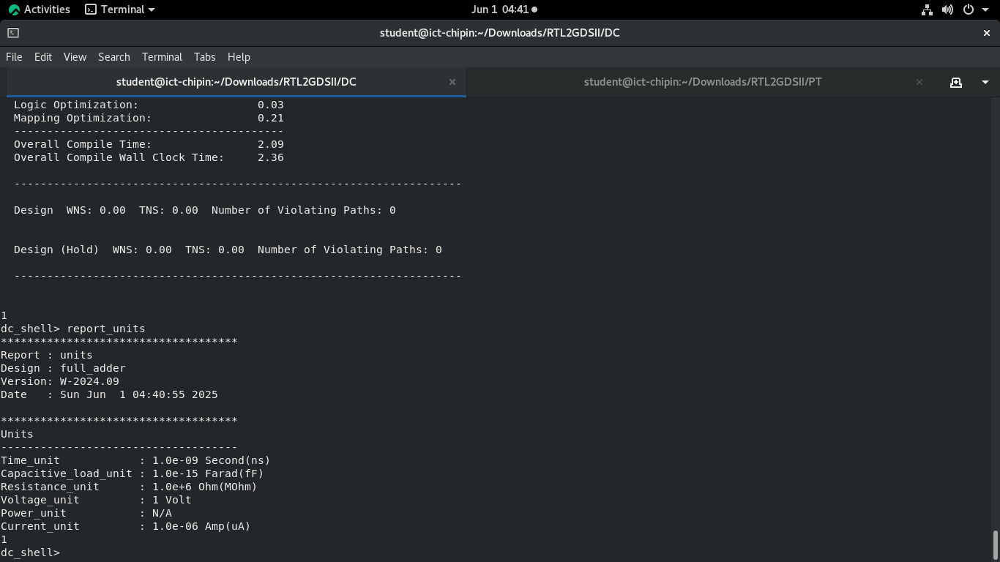

---

### 🔹 4. Floorplanning (ICC2)

- Tool: ICC2 with SAED 32nm PDK
- Core Utilization: 60%
- Pins auto-placed
- Floorplan saved and opened as `RIPPLE_ADDER`

**Floorplan Layout:** 
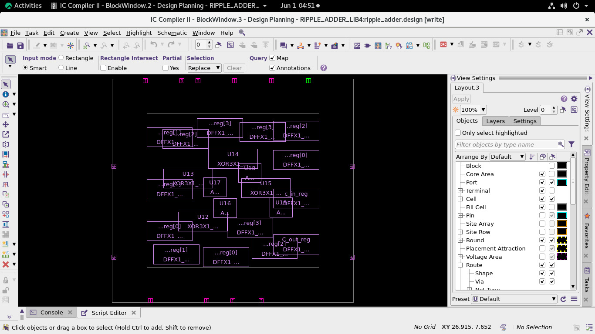

---

### 🔹 5. Power Planning

- Core rings and mesh using M7/M8/M6 layers
- Standard cell rails created on M1

**Power Plan Visualization:** 

---

### 🔹 6. Placement

- Legalized using `place_opt` and `legalize_placement`
- Placement checked with parasitic models

**Placement Layout:**  
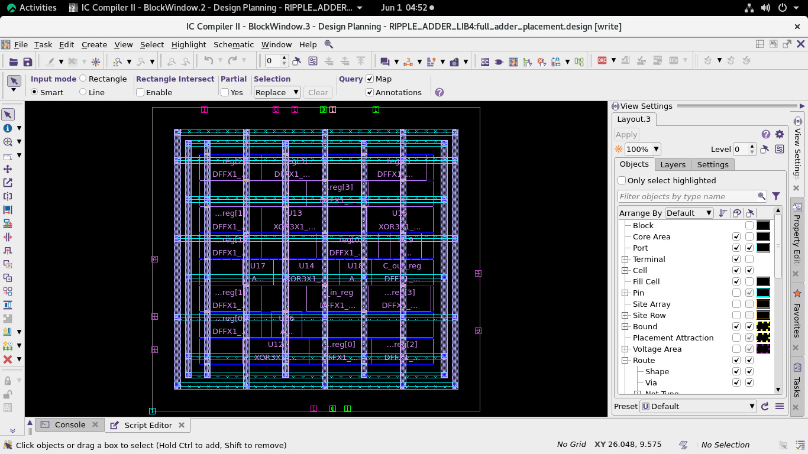

---

### 🔹 7. Clock Tree Synthesis (CTS)

- CCD flow with local skew optimization
- Clock network synthesized and routed

**CTS Result:**  
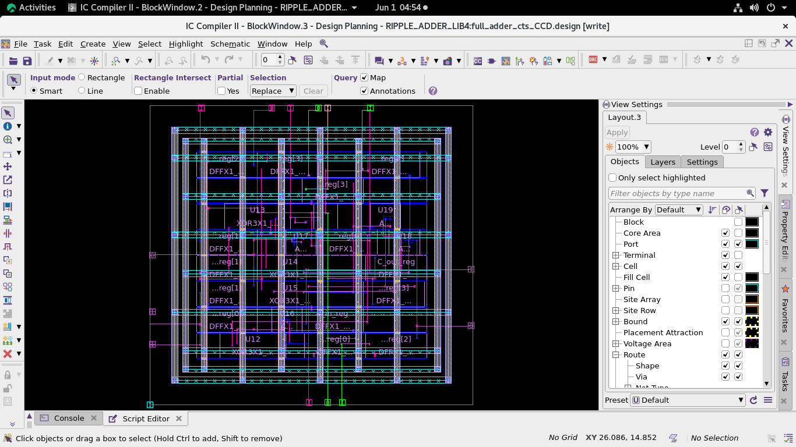

---

### 🔹 8. Routing

- Global, track, and detailed routing completed
- Antenna violations fixed using diodes

**Routed Design:**  

---

### 🔹 9. Static Timing Analysis (PrimeTime)

- Netlist, SDC, and SPEF loaded
- Final Slack: `+0.225552 ns`
- STA confirms timing closure

**Final Slack**
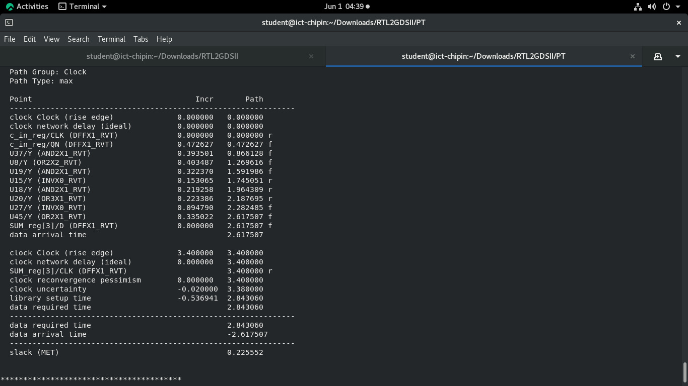

**Cell and Pin Count**
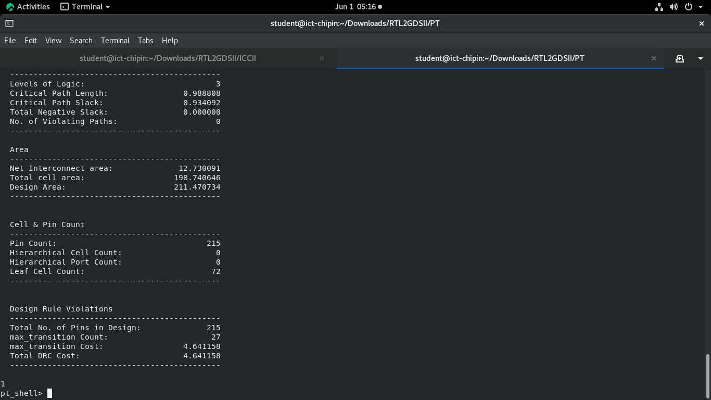

**PrimeTime Report:**  
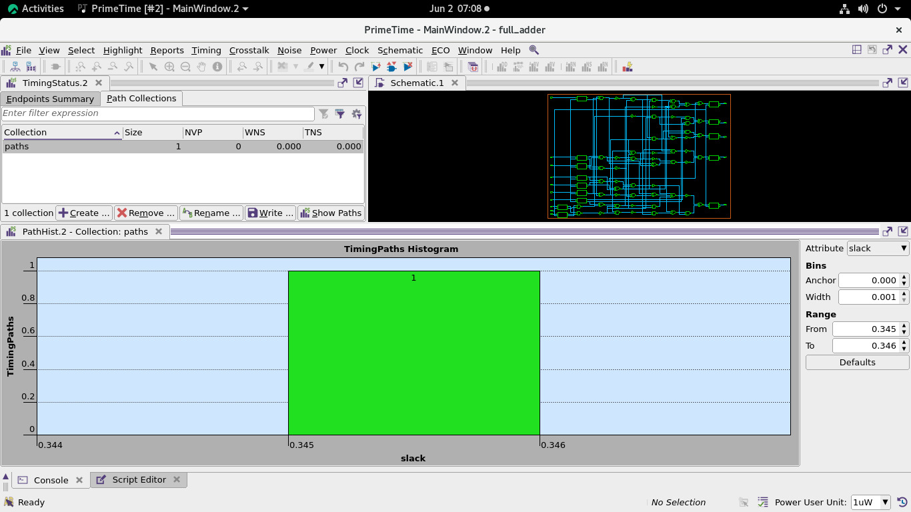

**Power Report**
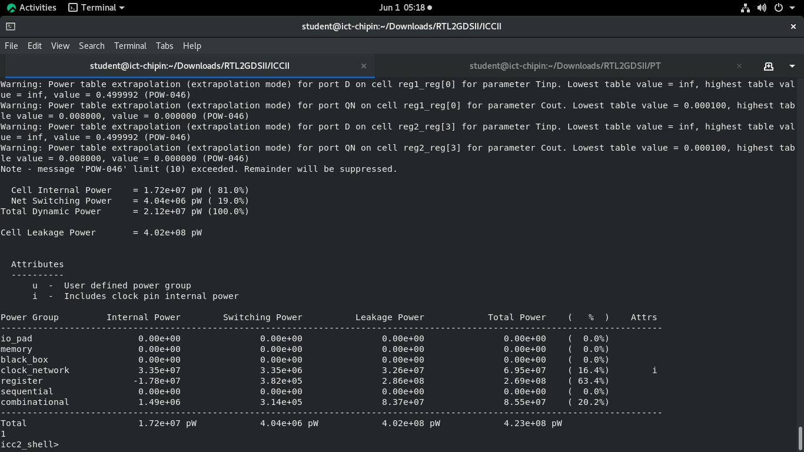

---

## 📊 Results

| Metric           | Value             |
|------------------|------------------|
| **Area**         | 34.149 μm²        |
| **Final Slack**  | +0.225552 ns      |
| **Clock Period** | 3.4 ns            |
| **Power**        | *From PT Report*  |
| **Library**      | SAED 32nm SS      |

---

## Conclusion

This project successfully demonstrates the entire RTL to GDSII design flow of a classic digital component using Synopsys tools. The design met all performance and area goals under the 32nm technology node, with validated timing through STA.

The result confirms a solid understanding of the full ASIC flow—from RTL to layout—and reinforces best practices in power planning, timing closure, and physical optimization.

